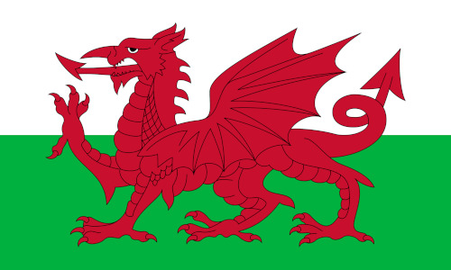

## LinguaCafe
LinguaCafe is a free self-hosted software that helps language learners acquire vocabulary by reading. It provides a set of tools to read, look up unknown words and review them later as effortlessly as possible.

You can read about all the features of LinguaCafe in this [overview](https://simjanos-dev.github.io/LinguaCafeHome/).

Supported platforms:
- x64, which includes most desktop computers made in the last decade.
- Macs with Apple silicon are supported, but need to uncomment the line that says `platform: linux/amd64` by removing the "#" near the end of the file.

Other Armv8 devices such as Raspberry Pis 3 and newer do not work at the moment.


## Language support
Lemma: a dictionary form of a word (E.g: worked -> to work).  
Gender tagging: extending nouns' lemma with additional information (E.g: hus -> et hus).

| Flag                                                          | Language  | DeepL   | Lemma generation | Gender tagging | Dictionaries          |
|:-------------------------------------------------------------:|:---------:|:-------:|:----------------:|:-------------------:|-----------------------|
|    | Chinese   | &check; |                  |                     | wiktionary, cc-cedict |
|      | Czech     | &check; |                  |                     | wiktionary, dict cc   |
|      | Dutch     | &check; | &check;          |                     | dict cc               |
|    | Finnish   | &check; | inaccurate       |                     | wiktionary, dict cc   |
|     | French    | &check; | &check;          |                     | wiktionary, dict cc   |
|     | German    | &check; | &check;          | &check;             | wiktionary, dict cc   |
|    | Italian   | &check; | &check;          |                     | wiktionary, dict cc   |
|   | Japanese  | &check; | &check;          |                     | jmdict, wiktionary    |
|     | Korean    | &check; | &check;          |                     | wiktionary, kengdic   |
|  | Norwegian | &check; | &check;          | &check;             | wiktionary, dict cc   |
|    | Russian   | &check; | &check;          |                     | wiktionary, dict cc   |
|    | Spanish   | &check; | &check;          |                     | wiktionary, dict cc   |
|    | Swedish   | &check; | &check;          |                     | dict cc               |
|  | Ukrainian | &check; |                  |                     | wiktionary            |
|      | Welsh     |         |                  |                     | wiktionary, eurfa     |

Chinese: Mandarin language with simplified Chinese characters.

## Installation (Linux)
Step 1: Install docker desktop

Step 2: Create the folders where the data will be stored. Four folders will be needed, one for `dictionaries`, one for `logs`, one for `database` and one for `temp`.

Step 3: Copy the `docker-compose.yml` provided [here](https://raw.githubusercontent.com/simjanos-dev/LinguaCafe/main/docker-compose.yml) and edit it to put the folders created in the step above in the indicated places.

```yml
volumes:
    - /your/linguacafe/dict/folder:/var/www/html/storage/app/dictionaries
    - /your/linguacafe/logs/folder:/var/www/html/storage/logs
    - /your/linguacafe/temp/folder:/var/www/html/storage/app/temp
# ...
volumes:
    - /your/linguacafe/database/folder:/var/lib/mysql
# ...
volumes:
    - /your/linguacafe/dict/folder:/var/www/html/storage/app/dictionaries
    - /your/linguacafe/temp/folder:/var/www/html/storage/app/temp
```

Step 4: Finally, run this command in the same folder where you placed the `docker-compose.yml` in the prior step.

```
docker compose up -d
```

Your server now should be running and accessible on http://localhost:9191. If you encounter any error, try stopping and restarting your docker container.

Please follow the instructions on this page in the `Importing dictionaries` section below to import dictionaries that you want to use.

## Known issues after first installation
Sometimes when opening LinguaCafe the first time there is an error message about users database table. If this happens, just stop and start your containers again, it should fix the problem.

```
docker compose down
docker compose up -d
```

If you are unable to import .epub files, it may be caused because of the permissions of your temp folder. Running this command should fix the issue.

```
sudo chmod 777 /your/linguacafe/temp/folder -R
```

These will be addressed in a future update.

## Updating to the latest version
Run these commands from the directory where you placed your `docker-compose.yml`:

```
docker compose pull
docker compose up -d
```

## Migrating from versions prior to v0.4
When editing the `docker-compose.yml` to add your storage paths, do these replacements to keep the files where they originally were created:

```
/your/linguacafe/dict/folder          ->  /path/to/this/repo/storage/app/dictionaries
/your/linguacafe/logs/folder          ->  /path/to/this/repo/storage/logs
/your/linguacafe/database/folder      ->  /path/to/this/repo/docker/mysql
```

It is also possible to move those three folders somewhere else with all their contents and use that path instead, in which case the cloned repo is not needed anymore and can be safely deleted after testing the migration was successful.

## Importing dictionaries
Step 1: Download the dictionaries that you want to use from the provided links below.

Step 2: Copy the dictionary files to your `dictionaries` folder that you specified in the `docker-compose.yml` file during installation.

Step 3: Go to the Admin -> Dictionaries page in LinguaCafe. Click on the `Import dictionary` button.

Step 4: This dialog will list all your importable dictionaries that are found in your `dictionaries` folder. Click on the `import` button for the dictionary that you want to import.

After the import process is finished, your dictionary should be working.

#### JMDict
Languages: Japanese

Download: [GitHub release](https://github.com/simjanos-dev/LinguaCafe/releases/tag/dictionaries)

All these 4 files are required to import JMDict:
- jmdict_processed.txt
- kanjidic2.xml
- radical-strokes.txt
- radicals.txt

This dictionary contains kanji and radicals for the Japanese language. Some Japanese features do not work without importing this dictionary.

#### CC-CEDICT
Languages: Chinese

Download: [GitHub release](https://github.com/simjanos-dev/LinguaCafe/releases/tag/dictionaries)

#### Kengdic
Languages: Korean

Download: [GitHub release](https://github.com/simjanos-dev/LinguaCafe/releases/tag/dictionaries)

#### Eurfa
Languages: Welsh

Download: [GitHub release](https://github.com/simjanos-dev/LinguaCafe/releases/tag/dictionaries)

#### Wiktionary
Languages: Chinese, Czech, Finnish, French, German, Italian, Japanese, Korean, Norwegian, Russian, Spanish, Ukrainian, Welsh

Download: [GitHub release](https://github.com/simjanos-dev/LinguaCafe/releases/tag/dictionaries)

#### <span>Dict</span>.cc
Languages: Czech, Dutch, Finnish, French, German, Italian, Norwegian, Russian, Spanish, Swedish

Download: [dict.cc](https://www1.dict.cc/translation_file_request.php?l=e)

This dictionary's license only allows personal use.

#### Custom dictionary
You can also import a custom dictionary file in the form of a .csv file.

#### DeepL translate
DeepL is a machine translation service that let's you translate up to 500.000 characters/month for free and is supported by LinguaCafe. You can set your DeepL Translate API key in the admin API settings.

You must enable DeepL translate for each language on the Admin -> Dictionaries page.

## Jellyfin configuration
You can use the network configuration from this example to connect Jellyfin's network with LinguaCafe. There are probably multiple ways to do it, the only requirement is that linguacafe-webserver should be able to reach Jellyfin's server to make API requests.

```
version: '3.5'
networks:
    linguacafe_linguacafe:
        external: true

services:
    jellyfin:
        image: jellyfin/jellyfin
        container_name: jellyfin
        user: 1000:1000
        volumes:
            - /path/to/config:/config
            - /path/to/cache:/cache
            - /path/to/media:/media:ro
        restart: 'unless-stopped'
        ports:
            - 8096:8096
        networks:
            - linguacafe_linguacafe
```

You must name your subtitle files in a way that Jellyfin will recognize as languages. These worked for me:  
```
Series Name - S01E01.ja.ass  
Series Name - S01E01.de.ass  
Movie name.es.ass  
```  

Language codes for subtitles filenames that Jellyfin recognizes: Chinese: `zh`, Czech: `cs`, Dutch: `nl`, Finnish: `fi`, French: `fr`, German: `de`, Italian: `it`, Japanese: `ja`, Korean: `ko`, Norwegian: `no`, Russian: `ru`, Spanish: `es`, Swedish: `sv`, Ukrainian: `uk`, Welsh: `cy`

[Jellyfin external file naming](https://jellyfin.org/docs/general/server/media/external-files/)

#### Possible error codes in browser console on the Media player page:
`unsupported language code: spa`: This means that Jellyfin recognized the language of the subtitle, but it is not supported by LinguaCafe yet. If you find one of these, please open a GitHub Issue, this should be fixed.  

`unsupported language code: unrecognized by jellyfin: japaaaneseee`: This means that Jellyfin did not recognize `japaaaneseee` as a language, and it can only be fixed by renaming the file following Jellyfin's naming conventions.  

If you have file naming issues and renamed a file, make sure you refresh metadata in Jellyfin before reloading LinguaCafe.

## Jellyfin API usage
Step 1: Create an API key in Jellyfin. You can do this on the Dashboard -> API Keys menu.

Step 2: Set the created API key in LinguaCafe on to the Admin->API menu.

Step 3: Set the Jellyfin host in LinguaCafe on to the Admin->API menu. If you used one of the pre-written configs, it should be the default http://jellyfin:8096.

Step 4: Save the settings.

Now you should be able to read any external subtitles from any TV Show you play in any of your Jellyfin clients on the Media player page.
Unfortunately there is the noticable lag when you click on a timestamp to jump to a subtitle. I could only make it work without delays with the native "Jellyfin media player" client on my PC.

At this time it only works with TV Shows due to a bug, it will be fixed soon. Later on there will be also an option to save the subtitles in the library like any text.

## Anki
Anki is supported, if your server and Anki run on the same PC (this will not be a requirement in the future) and have [AnkiConnect](https://ankiweb.net/shared/info/2055492159) plugin installed.

## Active development disclaimer
LinguaCafe is still in active development. There are missing features, and you might encounter some bugs while using the software. Please test it before you start actively using it, and make sure it is up to your expectations.

At this time only one user/server is supported.

## Contact information
[Discord invite](https://discord.gg/wZYZYrdaeP)

Discord user: linguacafe_47757

Reddit user: /u/linguacafe

Subreddit: /r/linguacafe

## Attributions
LinguaCafe uses many public resources. I am very thankful for these projects and for all the people who were working on them. They helped me greatly to create LinguaCafe.

**Spacy tokenizer**

License: MIT license

[Spacy website](https://spacy.io/)

[Spacy github](https://github.com/explosion/spaCy/)

[Spacy license](https://github.com/explosion/spaCy/blob/master/LICENSE)

**Pykakasi**

License: License: GNU General Public License 3

[Pykakasi website](https://codeberg.org/miurahr/pykakasi)

[Pykakasi license](https://www.gnu.org/licenses/gpl-3.0.html)

**EbookLib**

License: GNU Affero General Public License v3.0

[EbookLib github](https://github.com/aerkalov/ebooklib)

[EbookLib license](https://github.com/aerkalov/ebooklib/blob/master/LICENSE.txt)

**JMDict dictionary file**

License: Creative Commons Attribution-ShareAlike 4.0 International

[JMDict Project website](https://www.edrdg.org/jmdict/j_jmdict.html)

[JMDict license information](https://www.edrdg.org/edrdg/licence.html)

[JMDict license](https://creativecommons.org/licenses/by-sa/4.0/)

**KANJIDIC2 kanji file**

License: Creative Commons Attribution-ShareAlike 4.0 International

[JMDict Project website](https://www.edrdg.org/jmdict/j_jmdict.html)

[KANJIDIC2 license information](https://www.edrdg.org/edrdg/licence.html)

[KANJIDIC2 license](https://creativecommons.org/licenses/by-sa/4.0/)
&nbsp;

**CC-CEDICT dictionary file**  
License: Creative Commons Attribution-Share Alike 3.0 License

[CC-CEDICT website](https://cc-cedict.org/wiki/)
[CC-CEDICT license](https://creativecommons.org/licenses/by-sa/3.0/)
&nbsp;

**Kengdic dictionary file**  
License: GNU Library General Public License, version 2.0

[Kengdic github](https://github.com/garfieldnate/kengdic)
[Kengdic license](https://www.gnu.org/licenses/old-licenses/lgpl-2.0.en.html)
&nbsp;

**Eurfa dictionary file**  
License: The GNU General Public License 3

[Eurfa download website](https://www.kaggle.com/datasets/rtatman/eurfa-welsh-dictionary?resource=download)
[Eurfa bitbucket](https://bitbucket.org/donnek/eurfa/src/master/)
[Eurfa creator's website](http://kevindonnelly.org.uk/)
[Eurfa license](https://bitbucket.org/donnek/eurfa/src/master/gpl.txt)
&nbsp;

**Wiktionary**

License: Creative Commons Attribution-ShareAlike 3.0 Unported License

[Wiktionary website](https://en.wiktionary.org/wiki/Wiktionary:Main_Page)

[Wiktionary license](https://en.wiktionary.org/wiki/Wiktionary:Text_of_Creative_Commons_Attribution-ShareAlike_3.0_Unported_License)

The specific wiktionary files that LinguaCafe uses have been downloaded from [this](https://github.com/Vuizur/Wiktionary-Dictionaries) GitHub repository.

**<span>Dict</span>.cc**

LinguaCafe has no <span>dict</span>.cc dictionaries packaged in the software. It only provides a link to the <span>dict</span>.cc website.

[Dict.cc license](https://www1.dict.cc/translation_file_request.php?l=e)

**RADKFILE/KRADFILE**

License: Creative Commons Attribution-ShareAlike 4.0 International

[JMDict Project website](https://www.edrdg.org/jmdict/j_jmdict.html)

[KRADKFILE license information](https://www.edrdg.org/edrdg/licence.html)

[KRADKFILE license](https://creativecommons.org/licenses/by-sa/4.0/)

**DMAK kanji drawing library**

License: MIT license

[DMAK github project](https://github.com/mbilbille/dmak/)

[DMAK license](https://github.com/mbilbille/dmak/blob/master/LICENSE)

**KanjiVG**
License: Creative Commons Attribution-ShareAlike 3.0 Unported

[KanjiVG website](https://kanjivg.tagaini.net/)

[KanjiVG github](https://github.com/KanjiVG/kanjivg)

[KanjiVG license](https://creativecommons.org/licenses/by-sa/3.0/)
